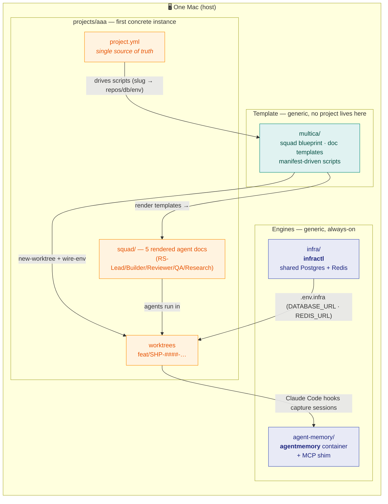
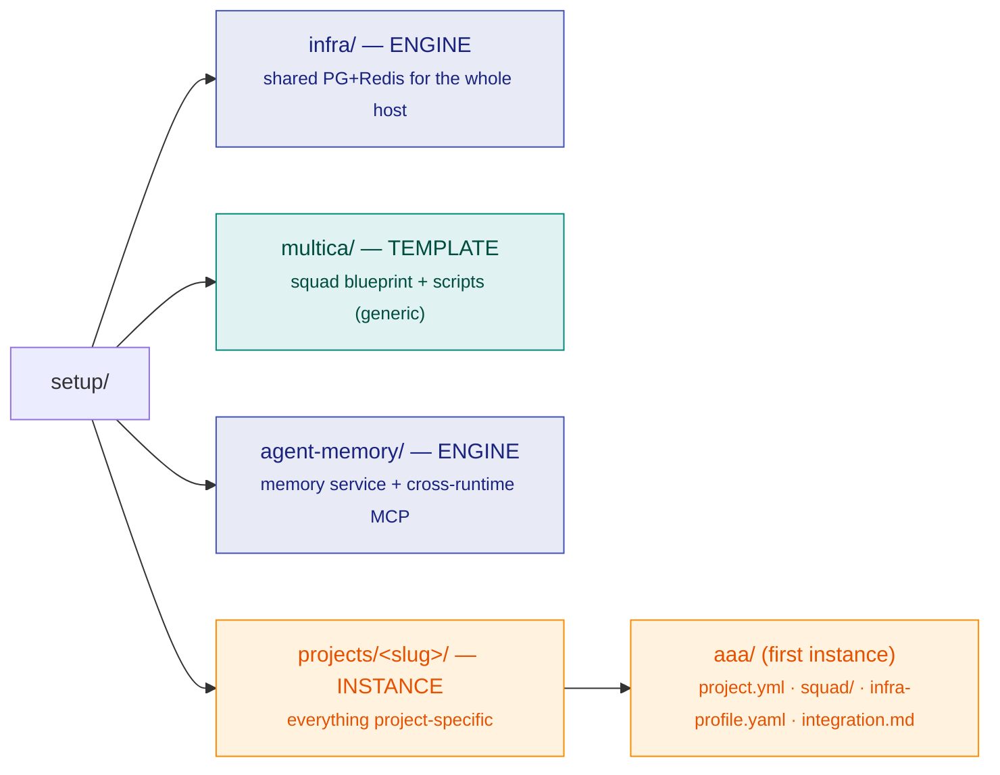
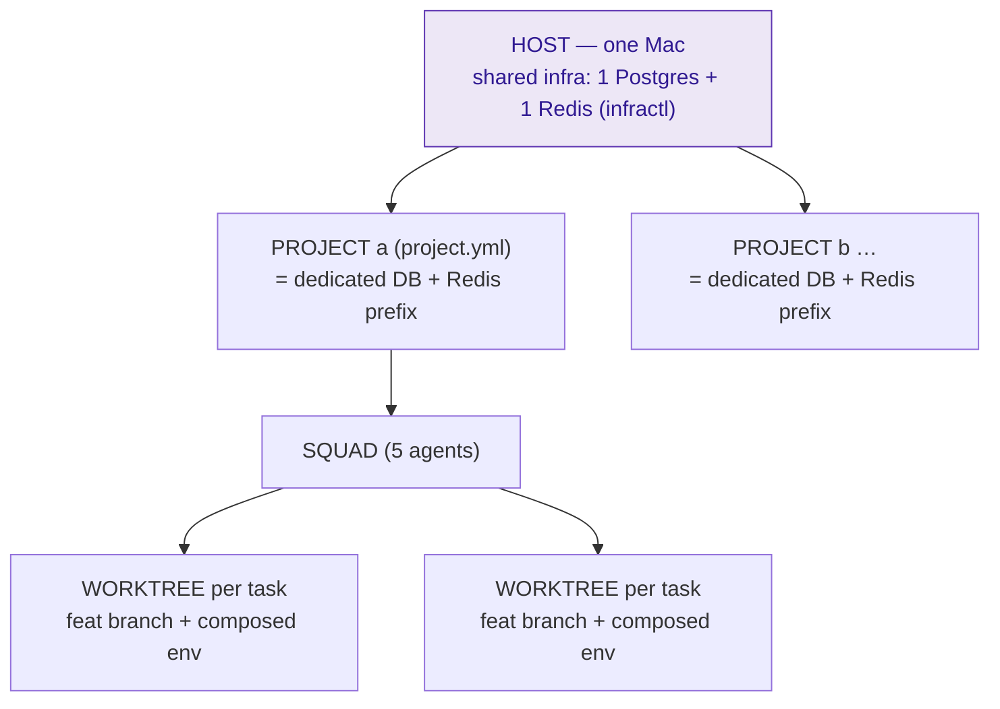

# Architecture overview

One picture of the whole `setup` workspace, then pointers into each domain's detailed docs.
The split is deliberate: **generic engines + a reusable template** on one side, **concrete projects**
that instantiate them on the other (see the root [README](README.md)).

## The big picture

How the two always-on **engines**, the **template**, and a concrete **project** fit together on one Mac.

**Read it as:** the manifest (`projects/<slug>/project.yml`) parameterises Multica's generic scripts;
those render the squad docs and spin up worktrees; the shared infra engine injects DB/Redis env into
each worktree; agents work there and their Claude Code sessions are captured by the memory engine.

## Repository map — engine vs template vs project

**The rule:** template/engine dirs stay pure and generic; concrete identifiers appear only inside
`projects/<slug>/`. Scripts are project-parameterised (take a `<slug>`, read the manifest) — never copied per project.

## The runtime hierarchy

One host carries many projects; each project is one squad over one isolated slice of shared infra.

> Isolation is **logical**: Postgres enforces a database per project; Redis is a per-project key
> prefix the app applies. Backend worktrees of one project share its DB → backend work serialises
> (a deliberate v1 trade-off with a free per-worktree upgrade path). See
> [infra high-level design](infra/docs/design/highlevel-design.md).

## Where to go next

| Domain | Start here | Deep dives |
|---|---|---|
| **Infra engine** | [infra/README](infra/README.md) | [high-level design](infra/docs/design/highlevel-design.md) · [ADR 0001](infra/docs/decisions/0001-shared-instance-logical-isolation.md) |
| **Multica template** | [multica/README](multica/README.md) | [high-level design](multica/docs/design/highlevel-design.md) · [env & execution flow](multica/docs/design/env-and-execution-flow.md) · [runtime & capacity](multica/docs/design/runtime-and-capacity.md) · [decisions](multica/docs/decisions/DECISIONS.md) |
| **Agent-memory engine** | [agent-memory/README](agent-memory/README.md) | [architecture](agent-memory/docs/architecture.md) · [runbook](agent-memory/docs/runbook.md) · [LLM backend](agent-memory/docs/llm-backend.md) |
| **Project aaa** | [projects/aaa/README](projects/aaa/README.md) | [infra integration](projects/aaa/integration.md) · [squad setup](projects/aaa/squad/README.md) |

The diagrams for each domain (infra topology, squad git-flow & gates, the 3-source env model, the
memory data flow) live inside those domain docs — linked above and rendered inline on this site.
