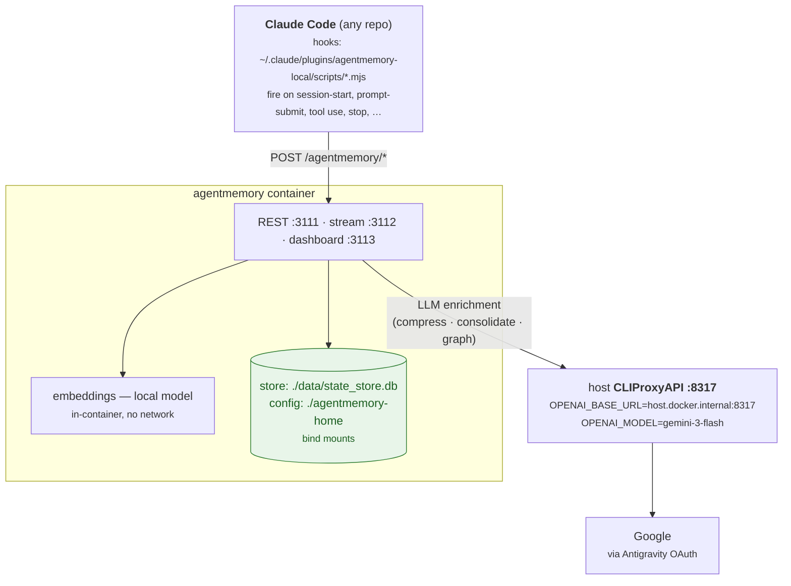

# Architecture

## Data flow

> Raw **capture + embeddings work without the LLM**. The CLIProxyAPI backend only powers the
> *enrichment* layer (compression, consolidation, graph extraction); if it's down, capture still
> works and those stay empty / fall back.

## Components

| Piece | Where | Role |
|---|---|---|
| `agentmemory` container | this compose | Capture, store, recall, dashboard. |
| Claude Code hooks | `~/.claude/plugins/agentmemory-local/scripts/*.mjs` | Emit observations to :3111. Registered in `~/.claude/settings.json`. |
| CLIProxyAPI | host service (brew, `:8317`) | OpenAI-compatible gateway to Google via Antigravity OAuth. Not managed by this compose. |
| Embeddings | in-container | Local model; cached in the `agentmemory_cache` named volume. |

## What the LLM is used for

Raw capture and embeddings work **without** the LLM. The LLM (CLIProxyAPI) powers the
*enrichment* layer:

- **Compression** — summarising each observation.
- **Consolidation** — turning clusters of observations into Lessons.
- **Graph extraction** — entities + relations for the Graph tab (`GRAPH_EXTRACTION_ENABLED=true`).

If the LLM backend is down, capture still works but these stay empty / fall back.

## Project naming (how sessions get their name)

The hooks' `resolveProject(cwd)` resolves in order:

1. `AGENTMEMORY_PROJECT_NAME` env, else
2. **git common dir → real repo name** (worktree-aware: a Conductor worktree like
   `…/infina-insurance-partner-webapp/austin` resolves to `infina-insurance-partner-webapp`,
   not `austin`), else
3. cwd basename.

Sessions whose cwd matches `CodexBar/ClaudeProbe` are skipped entirely (health-probe noise).
See [decisions/0003-claudeprobe-and-worktree-hook-fixes.md](decisions/0003-claudeprobe-and-worktree-hook-fixes.md).

## Ports

| Host | Container | Purpose |
|---|---|---|
| 127.0.0.1:3111 | 3111 | REST API (clients connect here) |
| 127.0.0.1:3112 | 3112 | stream |
| 127.0.0.1:3113 | 3114 → 3113 | viewer/dashboard (socat hop inside container) |
