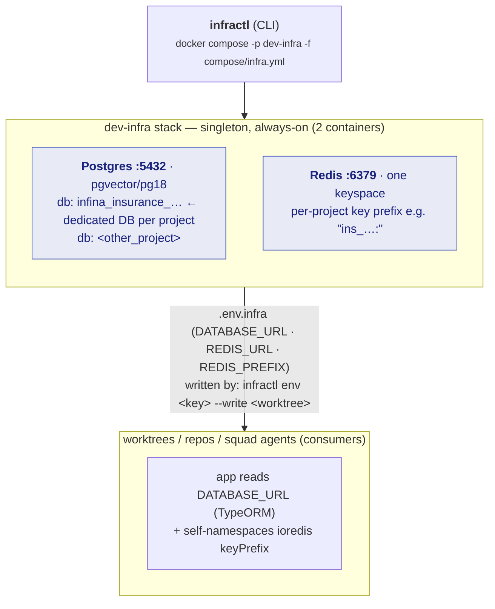

# High-level design — shared local dev infra

> Generic engine. Concrete names below (`infina_…`, `insurtech`, `@infinavn/common`) are the
> **`aaa`** first instance — see `../../../projects/aaa/integration.md`. A project maps to one
> `infra.key` (in `projects/<slug>/project.yml`) → one DB + one Redis prefix.

## Goal
One place that defines local dev infra for **all** projects and the Multica agent squad on
this host, scaling to multiple projects/squads **without collision** — and without the
container cost of per-project or per-worktree stacks.

## Shape

- **DB per project** is Postgres-enforced (hard isolation). **Redis prefix** is by convention —
  the app applies it; infra does not enforce it.
- One key (`infra.key` in `projects/<slug>/project.yml`) → one DB + one prefix. Worktrees of the
  same project share them (so backend work serialises — see below).

## Why this shape (and what was rejected)
- **Rejected: per-worktree container stacks** (unique project + port offsets). Truly isolates
  and unblocks parallel backend, but N×(PG+Redis) containers — too expensive on one host.
- **Rejected: keep per-repo compose** (status quo). No central place to scale squads; each
  repo a separate source of truth.
- **Chosen: one shared instance, logical isolation.** Cheapest (2 containers total). DB-per-
  project is Postgres-enforced; Redis prefix is by convention. Accepts a serialized backend
  and a shared blast radius as the cost of cheapness.

## Isolation grain — per-project (v1)
A project key (e.g. `infina-insurance-partner-services`) maps to one database + one prefix.
**Worktrees of the same project share them.** Consequence: backend tasks serialize (they'd
clobber each other's migrations/seed) — consistent with multica DECISIONS #12.

**Free upgrade path:** key per-worktree (`…-services-SHP-1234`) instead. Extra logical DBs
cost ~nothing (no new container), and it unblocks parallel backend. Cost = re-running
migrations/seed per worktree DB. Pure key-convention change in `infractl env` callers; no
infra change.

## Consumer integration
1. `infractl up` once (idempotent; leave it running).
2. Per project (or worktree, later): `infractl db-create <key>`.
3. `infractl env <key> --write <worktree-dir>` → `.env.infra` (DB_* + DATABASE_URL + REDIS_URL).
4. App consumes the vars:
   - **Postgres** — `@infinavn/common` `PGConfig` reads discrete `DB_HOST/DB_PORT/DB_NAME/
     DB_USERNAME/DB_PASSWORD`. `DATABASE_URL` is used by Makefile dump/restore + typeorm CLI.
     No code change. ✅
   - **Redis** — the app already self-namespaces (`new Redis(url, {keyPrefix:'ins_'})`), so
     shared Redis is safe with no change. ✅ Infra does **not** inject a Redis prefix.
5. Migrations/seed: the repo's own tooling (`make migrate`, `migration-run.sh`), pointed at the
   injected env. `CREATE EXTENSION vector` is handled by the app's migrations (pgvector image).

## This is now THE local stack
Runs on standard ports (5432/6379); repos' own `docker-compose.local.yml` are retired — don't
run them alongside (they'd clash on the same ports). Remaining migration step: fold the BE
repo's `yarn setup-local` into `infractl` (or point it at `.env.infra`) so the repo stops
declaring its own stack.

## Extend later (stubs, not built — YAGNI)
- `compose/localstack.yml` — AWS emulation; add when a repo first pulls `@aws-sdk`.
- `compose/observability.yml` — Grafana/Jaeger as the one genuinely-shared singleton.

## State
No state file. Databases are listed from Postgres directly; the Redis prefix is derived
deterministically from the key. Nothing to keep in sync.
