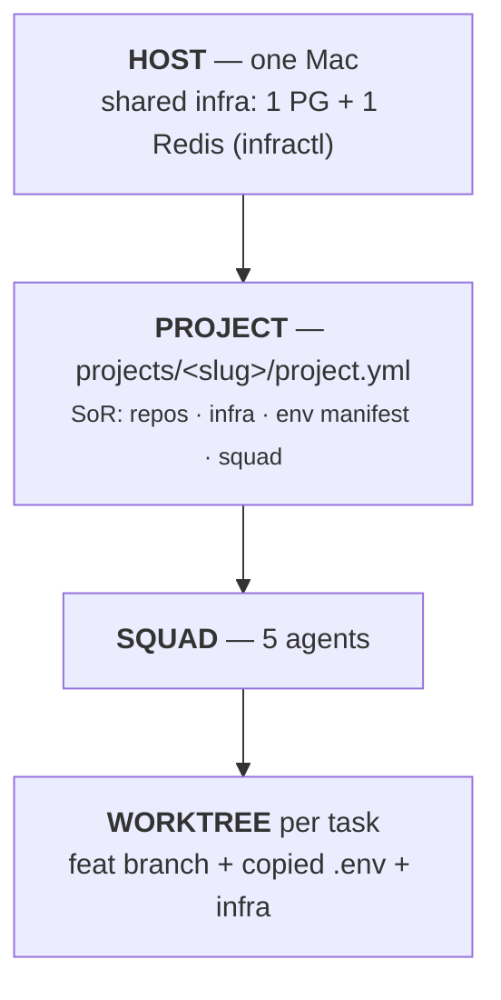
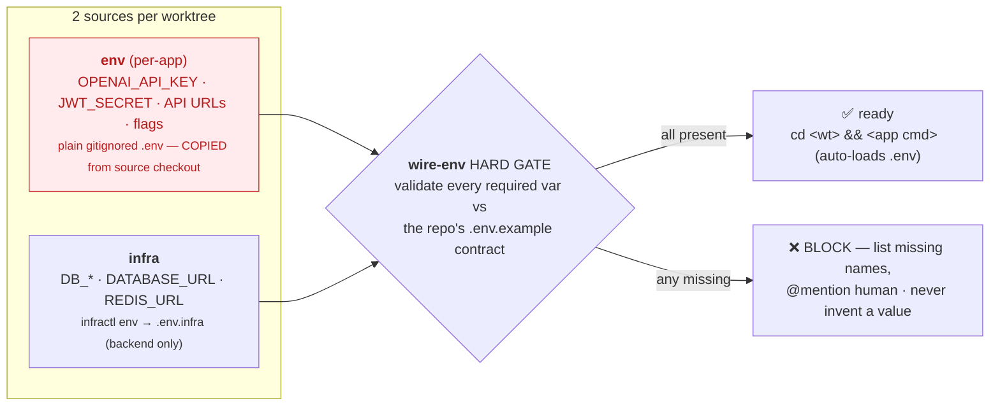

# Env Model & Execution Flow — squad ⇄ infra ⇄ worktree (blueprint)

> How a task flows from human intake to QA-green, and exactly how each agent gets a
> runnable, correct env. **Generic blueprint** — concrete identifiers are the **`aaa`** first
> instance (`../../../projects/aaa/`); read `<repo-*>`/`<fe-apps>`/`<be-app>` as a project's
> values from `projects/<slug>/project.yml`. Manifest (aaa): `../../../projects/aaa/project.yml`.

## 0. Hierarchy (high → detail)



Many projects sit on one infra; each project = dedicated DB + Redis prefix + one squad.

## 1. Intake — human-driven, NO auto-pull (concern #1)
- **You** create the Multica issue, assign RS-Lead, write the requirement + AC inline. Atlassian MCP is demoted to *optional status push-back*; agents do not auto-pull Jira.
- **File resources** (mockups, partner PDFs, exported HTML) → drop in
  `~/Work/infina-ai/<proj>/.squad/inbox/<ISSUE-KEY>/`. You cite that path in the issue.
  Lead reads from disk. Figma/Confluence = paste a link (Lead pulls via MCP only if needed).
- Lead → PRD/design → **GATE 1 (human approves)** → slices sub-issues (each cites AC + train + inbox path).

## 2. Infra is human-owned; the manifest captures everything (concern #2)
- **You provision** infra once per project (driven by the manifest):
  `infractl up` · `infractl db-create <key>`. **Agents NEVER create/drop DBs.**
- `projects/<slug>/project.yml` is the single source of truth: repos+path, infra (db/redis/schema/image),
  the **env manifest** (every var → `infra|config|secret`), squad, trains, inbox path.
- `new-worktree.sh` no longer creates DBs — it only *emits* infra vars (assumes DB exists; if not → error "ask human to provision"). The infra-only profile now lives at `projects/<slug>/infra-profile.yaml`.

## 3. The env model (concern #3) — conductor flow: copy the app's `.env` per worktree
A service's runtime env comes from two sources; the agent never hand-assembles a secret file:

| Source | Examples | Provided by | In a file? | Secret? |
|---|---|---|---|---|
| **env** | `OPENAI_API_KEY`, `JWT_SECRET`, API URLs, flags, ports | the app's **plain, gitignored `.env`** (local) / `.env.staging` — **copied** root→worktree | yes | yes (NON-PROD only) |
| **infra** | `DB_*`, `DATABASE_URL`, `REDIS_URL` | `infractl env` → `.env.infra` | yes | no (host-local) |



**Conductor flow (no dotenvx).** Each app keeps a **plain, gitignored** env file the human maintains
in the source checkout — `local` → `.env`, `staging` → `.env.staging`. A fresh `git worktree` does
not carry gitignored files, so `wire-env` **copies** the app's stage file into the worktree (copy, not
symlink → the worktree is self-contained; edits there never touch the source). The app **auto-loads
`.env`** at run time (Nx/Next/NestJS native env loading) — no `dotenvx run` wrapper. **USE, never
EXPOSE**: agents run env-consuming commands but never print/echo/commit a value. *(Threat note: on one
host the agent technically can read what it runs — protection is policy + NON-PROD-only values, not
hard isolation.)*

**`.env.example` is the CONTRACT.** Each repo commits `.env.example` (or `.env.sample`) listing every
var it needs (grouped `# infra / # config / # secret`). The env is multi-level: e.g. webapp has a root
`.env.example` *plus* per-app `apps/nomi/.env`, `apps/admin/.env`. The contract is the **template**;
the gitignored `.env` holds the real local values.

**`.env.staging` guardrail.** The `staging` stage exists ONLY to reproduce bugs against real
staging data on AWS. It is **read/repro-only**: never run destructive ops, migrations, or seeds
against staging; never export/paste rows (PII rules, same as `make rehearse`); `.env.prod` is
**off-limits to agents entirely**. Default stage is `local`.

**Contracts already exist — point, don't recreate.** Both repos ship the contract files:
webapp `apps/{nomi,admin,nomi-mobile}/.env.example` (+ workspace-root `.env.example`); services
`apps/insurtech-service/.env.sample`. We do NOT rename `.env.sample` → `.env.example`: it's
whitelisted in `.dockerignore`/`.railwayignore`, referenced across docs/plans, and the repo sits on
the shared `release` branch. The gate is **name-agnostic** — it reads the `contract:` path from
`projects/<slug>/project.yml`. The value files are the plain `.env` / `.env.staging` listed under
each app's `stage_files:`.

**The HARD GATE (user):** before an agent works, `wire-env` validates the copied env against
the repo's contract — **every required var must resolve to a non-empty value** for the stage, or
it BLOCKS and reports the missing names. The agent never invents or fetches a value.

### Secrets that must be USED in tests (e.g. OpenAI chat)
- **Web (nomi `/api/copilotkit`, NestJS BE):** `OPENAI_API_KEY` is server-side → loaded from the
  copied `.env` at runtime → chat-AI E2E works, value never exposed.
- **React Native (nomi-mobile):** holds **no key** — AI calls route through the **local BE (:3333)**
  which has the key. RN worktree needs only the BE URL (config). Correct prod architecture; removes
  on-device key handling. *(A genuine on-device call would be a flagged sandbox-key exception.)*

## 4. `wire-env` — the worktree bootstrap (spec)
Run by/after `new-worktree.sh <project> <app> <KEY> <slug> <train> [stage]` (project=slug e.g. `aaa`; app from the manifest; stage defaults to `local`):
1. `infractl env <proj> --write <wt>` → `.env.infra` (infra source, backend only). Errors if DB not provisioned.
2. **Copy the env file into the worktree:** `wire-env` copies the app's stage file (`local` → `.env`, `staging` → `.env.staging`) from the source checkout (`APP_REPO_DIR`) into the worktree at the same relative path. It's gitignored, so a fresh `git worktree` lacks it; copy (not symlink) keeps the worktree self-contained. Source file absent → the gate below reports it by name.
3. **VALIDATE (the hard gate)**: read the surface's `contract:` from `projects/<slug>/project.yml` (name-agnostic — `.env.example` or `.env.sample`); for each required key confirm a non-empty value in the copied `.env` ∪ `.env.infra`. All required present → ✅ ready. Any missing → ❌ BLOCK, list names, @mention human. Never invent a value.
4. Print the run hint: `cd <wt> && <app cmd>` — the app auto-loads `.env` (FE `nx dev <app>` · BE `yarn start` → :3333). Mobile needs no secret — `EXPO_PUBLIC_API_ORIGIN` → local nomi web (:3000).

## 5. Full flow — task → QA-green → report

```mermaid
sequenceDiagram
    autonumber
    actor H as Human
    participant L as RS-Lead
    participant B as RS-Builder
    participant Q as RS-QA
    participant R as RS-Reviewer
    H->>L: create issue + drop resources in .squad/inbox/&lt;KEY&gt;/
    L->>L: read issue + inbox → PRD/design
    H-->>L: GATE 1 — approve design
    L->>B: slice sub-issues (AC + train + inbox path)
    B->>B: new-worktree + wire-env (copy .env + validate — BLOCK if incomplete)
    B->>B: run app (auto-loads .env) → implement 1 AC at a time → unit green
    B->>Q: push feat branch (no PR) → In-Review
    Q->>Q: per-feat E2E vs shared infra
    alt bug found
        Q-->>B: back to Builder
    else green per feat
        Q->>R: hand off
        R->>L: static diff review → approve
        L->>L: verify 3 greens → open + merge feat → release-&lt;slug&gt;
        L-->>H: GATE 2/3 — release→staging→master→tag
    end
```

1. Human: create issue + drop resources in `.squad/inbox/<KEY>/` → assign Lead.
2. Lead: read issue + inbox → PRD/design → **GATE 1** → slice sub-issues (AC + train + inbox path).
3. Builder: `new-worktree.sh …` → feat branch + `yarn install` + **wire-env** (`.env.infra` + copy the app's `.env` + validate vs the contract; BLOCK if incomplete).
4. Builder: run the app (auto-loads the copied `.env`, values unseen) → implement one AC at a time → unit green.
5. Builder: push feat branch → In-Review → @Lead (no PR).
6. QA: per-feat, in the worktree, run E2E (app auto-loads `.env`) — web → local BE (keys present); RN → local BE → green per feat. Bug → back to Builder.
7. Reviewer: static diff review → approve.
8. **Lead** (sole funnel): verify 3 greens (QA-per-feat · Reviewer · checks) → open + merge `feat → release-<slug>`.
9. **GATE 2/3 (human):** release-<slug> → release → staging (AWS) → master → tag.

## 6. Script implementation (DONE — generic, manifest-driven)
- `new-worktree.sh <project> <app> …` + `wire-env.sh <project> <app> <wt> [stage]`: no `db-create` (human owns DBs); `wire-env` copies the app's stage `.env` and runs the validate gate (reads the `contract:`, fails closed on missing vars), then prints the run hint. All facts resolve from the manifest via `scripts/project-meta` — no hardcoded project.
- Cards (rendered in `projects/<slug>/squad/`) + constitution template: run the app directly (auto-loads `.env`) + the completeness hard gate.
- The infra profile moved to `projects/<slug>/infra-profile.yaml` (the old `infra/profiles/*.yaml` is superseded by the consolidated `project.yml`).

## Resolved
1. **Env delivery = conductor flow (2026-06-22, DECISIONS #24)** — plain gitignored `.env` (local) / `.env.staging`, **copied** root→worktree by `wire-env`. dotenvx dropped (it was breaking local work; no encryption/keys to wire; worktrees are self-contained). The hard gate now reads the plain file.
2. **Contracts already exist** — services `apps/insurtech-service/.env.sample`, webapp per-app `.env.example`. No new file authored; gate reads `contract:` from the manifest (name-agnostic). Renaming `.env.sample` is unsafe (dockerignore/railwayignore/docs + `release` branch).
3. **Stages = `local` (`.env`) + `staging` (`.env.staging`)** (staging for real-staging bug repro, read-only + PII rules; `.env.prod` off-limits to agents).
4. **Mobile→BE confirmed in code**: `apps/nomi-mobile/src/config.ts` → `COPILOT_URL = ${API_ORIGIN}/api/copilotkit`; no `OPENAI_API_KEY` on device. `.env.example` is `EXPO_PUBLIC_*` only (non-secret by design).

## Remaining (project owner, one-time per repo)
- Create the per-app `.env` (local) in each repo checkout with NON-PROD dev values (gitignored); `.env.staging` only if staging repro is needed. wire-env copies + validates them.
- Verify `apps/admin/.env.example` secret set; reflect any required secret into the manifest `secrets.required_local`.
