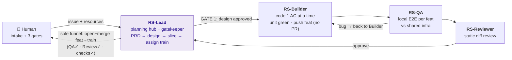
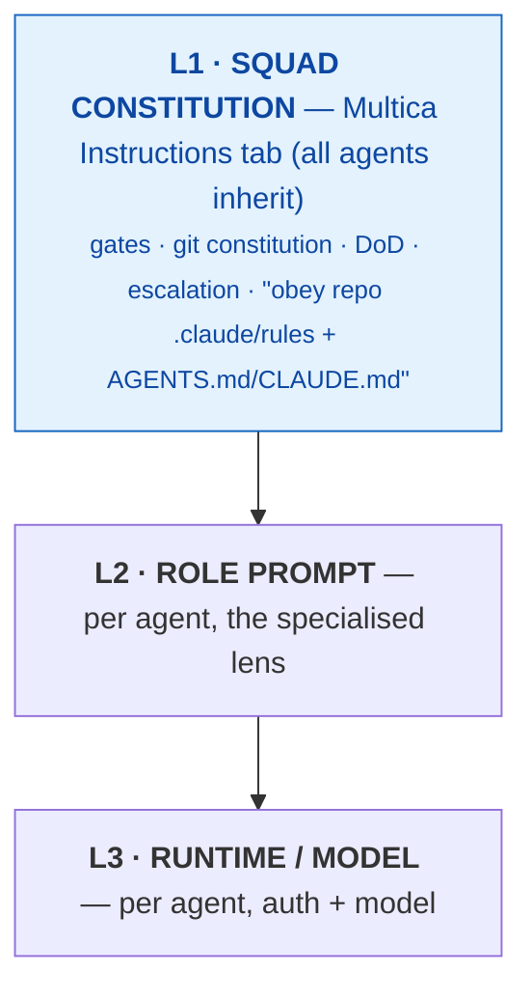
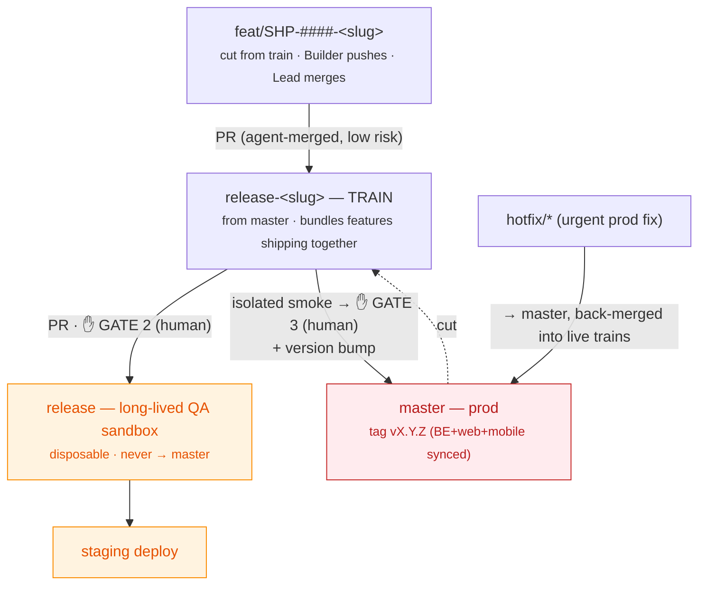

# Multica Agent Squad — High-Level Design (blueprint)

> **Generic squad blueprint.** Concrete identifiers (repos, apps, paths, squad name, tracker key)
> are illustrated with the **`aaa`** first instance — see `../../../projects/aaa/`. To reuse for
> another project, read `<repo-fe>` / `<repo-be>` / `<fe-apps>` / `<be-app>` / `<squad>` as that
> project's values from `projects/<slug>/project.yml` (legend: `../templates/README.tmpl.md`).
> Per-agent spec cards: `../templates/rs-*.tmpl.md` (rendered per project under `squad/`). Created 2026-06-20.
> Supersedes the high-level parts of `../archive/*` (those remain as supporting/runtime detail).

## 1. Project context (aaa example — verified from repos)

| | Repo | Stack | Apps | Tests |
|---|---|---|---|---|
| FE | `RealStake/infina-insurance-partner-webapp` (`@org/source`) | Nx + yarn, Next.js, React Native | **`nomi`** (user web), **`admin`** (admin web), **`nomi-mobile`** (RN) | vitest (unit), **Playwright present** (web E2E), **Maestro absent** (mobile E2E = gap) |
| BE | `RealStake/infina-insurance-partner-services` | Nx + yarn, NestJS, Docker | `insurtech-service` | jest |

**Cross-repo contract:** BE↔FE is codegen'd — `yarn gen:api` (openapi-typescript) regenerates `libs/types/src/api.gen.ts` from BE OpenAPI. Any BE API change ⇒ regen + verify FE consumers.

**Existing agent infra (reuse, don't duplicate):** both repos ship `AGENTS.md`, `CLAUDE.md`, `.claude/rules/*`, `opencode.json`. Squad constitution **references** these as the source of truth for dev rules / workflows.

**Issue tracking — Jira is single source of truth.** Team already uses Jira (`SHP-####` keys; branches prefixed with the Jira key). Multica is the agents' *execution lane*, NOT a second tracker:
- Jira key is the canonical handle everywhere — branch `feat/SHP-####-<slug>`, PR title, Multica issue title (`SHP-####: …`).
- RS-Lead intakes a Jira ticket → creates thin Multica sub-issues referencing the key → status pushed back to Jira.
- **Wire Atlassian MCP to RS-Lead** so it reads Jira tickets directly + posts status/PR-link comments back. No manual double-entry. No two-way board sync.

## 2. Team architecture — lean 5

| Agent | Role | Runtime | Model / auth | Standing |
|---|---|---|---|---|
| `RS-Lead` | leader | Claude Code | Claude Max 5x (Opus for design) | yes |
| `RS-Builder` | builder | Claude Code | Claude Max 5x (**Opus**, Sonnet fallback) | yes |
| `RS-Reviewer` | code-reviewer | OpenCode CLI | OpenCode Go → Qwen 3.7 Max | yes |
| `RS-QA` | qa | Codex | ChatGPT Plus (GPT-5.x) | yes |
| `RS-Research` | research | Antigravity CLI (`agy`) | Gemini 3.x via Antigravity (replaces deprecated Gemini CLI) | on-demand |

~$130/mo (Max $100 + Go $10 + Plus $20 + Ultra existing). Grows into Quang's specialist model in Phase 2.

## 3. Orchestration — hybrid (planning hub + kanban-pull execution)

**Planning hub + kanban-pull execution.** RS-Lead is NOT a per-PR dispatcher: it plans, slices, and
guards the gates. Execution flows pull-style Builder → QA → Reviewer → **Lead (sole funnel into the
train)**. Lead re-engages only at gates → saves Claude Max quota, removes the bottleneck.

## 4. Governance — 3-layer instruction model (DRY)

Constitution points to repo rules rather than restating them (single source of truth).

## 5. Workflow + gates (per feature)

**QA moved LEFT (2026-06-21):** E2E now runs **locally in the worktree against shared infra and must be green BEFORE the PR opens to the train** — not post-staging. Merging to the train already implies QA-passed code. Post-staging is integration smoke only.

| # | Step | Who |
|---|---|---|
| 1 | PRD + design + slice sub-issues, assign train (brief + resources attached, see §11) | RS-Lead → **GATE 1: human approves design** |
| 2 | `new-worktree.sh` → `feat/<TICKET>-<slug>` from train, infra env injected → code one AC at a time → unit green → **push feat branch (no PR)** | RS-Builder |
| 3 | **Local QA per feat** in the worktree vs shared infra (web Playwright / backend jest / mobile Maestro). Bug → back to Builder. Green-per-feat = required to enter the train. | RS-QA |
| 4 | Static review (clean diff) | RS-Reviewer → approve |
| 5 | **Opens** PR `feat → release-<slug>` **and merges** it, after QA-green-per-feat + Reviewer-approved + checks green | **RS-Lead — sole funnel into the train** |
| 6 | **GATE 2: human** merges `release-<slug>` → `release` → staging deploy | human |
| 7 | Pre-prod: deploy train branch ALONE → integration smoke (since `release` is mixed) | RS-QA / human |
| 8 | **GATE 3: human** merges `release-<slug>` → `master` → tag + version bump | human |

## 6. Git flow + versioning (release-train, locked)

- **Mostly-bundled + hotfix exception**: normal work via trains; urgent prod fix `hotfix/*`→`master`, back-merged into live trains.
- **Versioning**: single synced tag `vX.Y.Z` across all 3 repos at prod merge; **deploy async** (web/BE now, mobile on app-store clock); **BE backward-compatible with previous mobile version** (non-negotiable).
- `release` = disposable QA sandbox, never→master; reset from `master` periodically (human/CI), never agents.
- Trains kept small/short-lived; synced via periodic `master`→train merge (Builder/Lead/CI).

**Train naming:** `release-<slug>` (per-epic/feature-bundle slug), cut from `master`. Coexists with existing weekly trains (`release-w/NN`) and `release-mobile`. Lead names the train + assigns each sub-issue to it.

**Agent git constitution:**
Builders only cut `feat/SHP-####-<slug>` from the **assigned train**, commit (conventional), and **push their own branch** — they do **NOT** open the feat→train PR. **RS-Lead is the sole funnel into a train:** Lead opens the `feat→release-<slug>` PR and merges it once QA is green-per-feat + Reviewer-approved + checks green (a lightweight train-entry check, not a re-review). Agents **never** open/merge the train PR, merge to `release`/`master`, force-push, delete shared branches, or touch another agent's branch. One sub-issue = one branch. Multi-repo feature = same branch name in both repos, two PRs (both opened by Lead), promoted at same gates.

> ⚠️ **Identity gap (interim):** no dedicated bot account yet — agents run under the **owner's personal GitHub account**. This removes the hard "agent physically can't merge master" safety net. Compensating controls REQUIRED until a bot account exists:
> - Branch-protect `master` + `release`: require PR + ≥1 review + passing checks, **block direct/force-push**, and **enable "Include administrators / Do not allow bypassing"** — so even the owner's account is forced through the gates.
> - Tag agent commits with a trailer (e.g. `[agent:RS-Builder]` / `Co-authored-by:`) to distinguish agent vs human work.
> - Phase-0 follow-up: provision a fine-grained PAT / service account scoped to only these 2 repos, excluded from merging protected branches.

## 7. QA surface map (grounded)

| Surface | App | Tool | Status |
|---|---|---|---|
| user web | `apps/nomi` | Playwright (via @nx-playwright) | ✅ reuse |
| admin web | `apps/admin` | Playwright | ✅ reuse |
| RN mobile | `apps/nomi-mobile` | **Maestro (local sim/emulator)** | ⚠️ scaffold (absent) — first QA task |
| backend | `insurtech-service` | jest + Docker repro | ✅ reuse |

QA host = this Mac (Xcode sim + Android emulator for mobile). **QA proves bugs, Builder fixes.** Reuse existing Playwright/jest; only scaffold the Maestro gap.

**Mobile QA is local + pre-merge.** RS-QA runs Maestro on a **local** build (sim/emulator) and it must be **green before the feature is merged**. Merging is what triggers the **EAS build downstream** — so no EAS build is spent on un-QA'd code. EAS/app-store release stays a post-merge, human/CI concern, not part of agent QA.

## 8. Top risks + mitigations

1. Claude Max weekly cap (Lead+Builder **both Opus**, share one login) → **Builder auto-falls-back to Sonnet** under cap pressure; keep trains small; if it walls weekly, give Builder its own Max login (+$100).
2. Qwen reviewer misses subtle TS bugs → rubric + **mandatory human review on any `api.gen.ts`/contract change**.
3. QA 4 surfaces / mobile sims slow → serialize; split `RS-QA-Mobile` if it bottlenecks (Phase 2).
4. Train all-or-nothing / drift → small trains, periodic `master`→train sync, descope = revert merge commit.
5. Staging mix ≠ prod → mandatory isolated train-branch smoke before GATE 3.
6. Nx monorepo context blow-out (200K/agent) → scope agents to the specific app (`nx affected`, target one `apps/*`), never "whole monorepo".
7. Single-Mac daemon → keep-awake (caffeinate); if Mac sleeps, squad dies.

## 9. Phase-2 growth triggers

- PR volume high / reviewer blind spots → split `RS-Reviewer` into contract / architecture / orchestration lenses (Quang model).
- Mobile QA bottleneck → dedicated `RS-QA-Mobile`.
- Stuck-task toil → add `RS-Monitor` watchdog.
- 24/7 throughput → move GPT side to API/cliproxy (subs won't sustain Quang-scale 447M tok/mo).

## 10. Next step

Per-agent detail doc: full **spec cards** for each of the 5 agents (name, runtime, model, complete system prompt aligned to repo `.claude/rules`/`AGENTS.md`, repo+app scope, branch policy, escalation, I/O contract) + the **squad constitution full text** + the Multica setup sequence. Then `/ck:plan`.

## 11. Requirement intake + worktree env (execution mechanics)

**Hierarchy:** shared infra (1 PG + 1 Redis) → many **projects** (each = dedicated DB + Redis prefix) → each project has **1 Multica squad** → squad = 5 agents. `aaa` = project at `~/Work/infina-ai/aaa` (2 repos) → squad `infina-insurance-dev`.

**A. How RS-Lead receives a requirement + resources**
- **Jira** ticket `SHP-####` is the entry (Atlassian MCP — Lead reads it directly).
- **Design** → Figma MCP (Lead pulls design context/screens). **Partner docs** → Confluence (Atlassian MCP).
- **Ad-hoc local files** (HTML mocks, partner PDFs not in Jira/Confluence) → drop in **`~/Work/infina-ai/<proj>/.squad/inbox/SHP-####/`**. Lead reads them and **cites the brief path + resource links in each sub-issue tech spec** so downstream agents have everything without re-asking.
- Lead → PRD + design + slices → thin Multica sub-issues (each cites AC-ids, the train, and the brief location) → **GATE 1**.

**B. How an agent starts work in a worktree (the env wiring)**
1. `scripts/new-worktree.sh <project> <app> <KEY> <slug> <train> [stage]` (`project`=slug e.g. `aaa`; `app` from the manifest) → worktree `<local-path>/wt/<KEY>-<app>` on `feat/<KEY>-<slug>` from the train, `yarn install` (shared cache).
2. **Env wired + VALIDATED by `wire-env.sh`** (DECISIONS #16): **backend** gets `infractl env --write` → `.env.infra` (dedicated DB + Redis prefix; DB is human-provisioned, NOT created here). Secrets via dotenvx. **Hard gate:** required vars must resolve against the surface's `.env.example`/`.env.sample` or it BLOCKS by name.
3. **Secrets** (NON-PROD) come from the **injector** at run time (`dotenvx/doppler/op run -- <cmd>`) — never a committed file; agents use, never read, values.
4. Agent runs the app (FE `nx dev <app>` · BE `yarn start` → :3333), works one AC at a time, then **local QA green → Reviewer → PR to train** (§5).
5. **Concurrency:** FE worktrees run in parallel; **backend serialized** — one services worktree at a time (all share the project DB). `new-worktree.sh` prints the warning.

## Resolved decisions (2026-06-20)
1. ✅ **Jira = source of truth.** `SHP-####` key drives branch/PR/Multica-issue naming. Atlassian MCP wired to RS-Lead. No two-way board sync.
2. ✅ **Trains named `release-<slug>`** (per-epic), cut from master; weekly `release-w/NN` coexist.
3. ⚠️ **Interim identity: owner's personal GitHub account** (no bot yet). Compensating controls in §6 are MANDATORY (branch protection incl. administrators + commit trailers). Provision bot account in Phase 0.
4. ✅ **Mobile QA = local Maestro, green pre-merge.** EAS build triggered downstream of merge; not part of agent QA.

## Open questions (remaining)
- None blocking. Phase-0 bot-account provisioning is the only deferred item; design proceeds with the interim controls.
